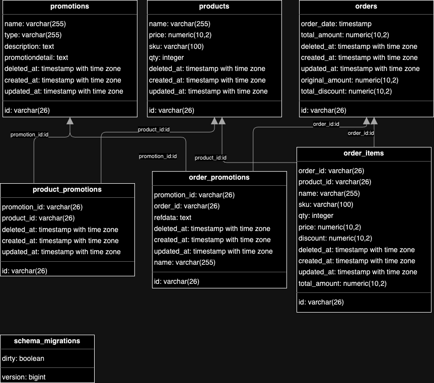

Penjelasan Mengenai tabel:

1. `schema_migrations` = table migrations
2. `products` = tabel master data untuk product
3. `orders` = tabel untuk menyimpan riwayat transaksi pembelian
4. `order_items` = tabel untuk meyimpan detail dari setiap order
5. `promotions` = untuk meyimpan master data promosi. promotion detail berisi object dan menyesuaikan berdasarkan typenya, contoh `{"type": "percentage", "threshold": 3, "discount": 10}`
6. `product_promotions` = menyimpan daftar produk yang terkait dengan promosi tertentu
7. `order_items` = menyimpan promosi yang berlaku pada setiap order
